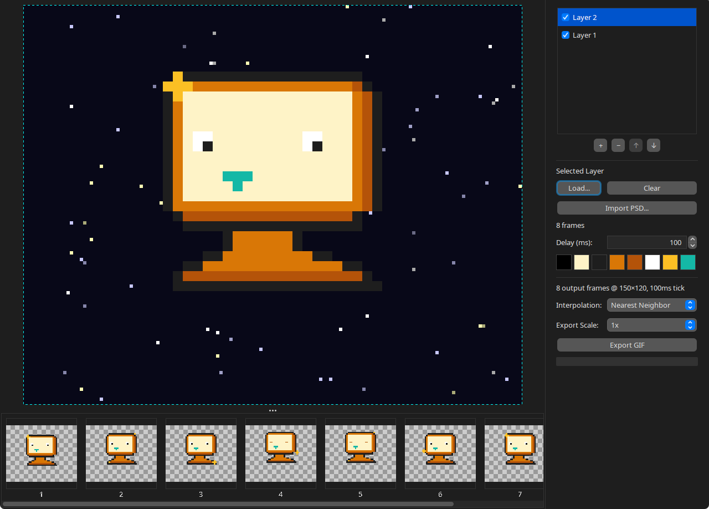

# ComposeGIF



A desktop tool for compositing multi-layer animated GIFs. Combine background layers, foreground effects, and sprites into a single animation with precise control over timing, positioning, and transparency.

## Features

- **Multi-layer compositing** -- Stack multiple animation layers with independent timing, visibility toggles, and per-layer transparent color selection. Layers are automatically synchronized so animations with different frame counts blend correctly.

- **Drag-to-position layer offsets** -- Click and drag layers in the preview to position them on the canvas.

- **Frame browser** -- Reorder frames via drag-and-drop, duplicate or delete individual frames, and hide frames from the output without removing them.

- **PSD import** -- Import Photoshop files with full layer hierarchy. Choose to import selected layers/groups as animation frames on one layer or as separate compositing layers.

- **Animated preview** -- Real-time preview of the composited animation with checkerboard transparency visualization.

- **Chromakey removal** -- Click colors in the palette panel to mark them as transparent per-layer. Useful for keying out background colors from indexed-color sprites.

- **GIF export** -- Export with 1x--16x upscaling (nearest neighbor, bilinear, or bicubic interpolation) and built-in optimization for global color tables where all frames share the same palette.

## Supported Input Formats

| Format | Notes |
|--------|-------|
| PNG sequences | Numbered files (1.png, 2.png, ...) loaded in natural sort order |
| GIF | Extracts frames with correct disposal handling; preserves embedded timing |
| PSD | Layers and groups via Photoshop import dialog |
| BMP, JPEG | Single frames or multi-select |

## Requirements

- Java 21+

## Running

### From source

```
./gradlew :app:run
```

### From release

Download the latest release zip, extract it, and run:

```
composegif.bat
```

The release includes a bundled JRE -- no separate Java installation required.

## Building

```
./gradlew :app:jar
```

Produces `app/build/libs/composegif.jar` (fat JAR with all dependencies).

### Building a distributable package

Requires `JRE_TARGET` environment variable pointing to a JDK 21+ installation:

```
export JRE_TARGET=$JAVA_HOME
./gradlew :app:dist
```

This creates a `jlink` custom runtime alongside the fat JAR under `app/build/`.

## License

This project is licensed under the [GNU General Public License v3.0](LICENSE).

This program is free software: you can redistribute it and/or modify it under the terms of the GNU General Public License as published by
the Free Software Foundation, either version 3 of the License, or (at your option) any later version.

This program is distributed in the hope that it will be useful, but WITHOUT ANY WARRANTY; without even the implied warranty of
MERCHANTABILITY or FITNESS FOR A PARTICULAR PURPOSE. See the GNU General Public License for more details.

You should have received a copy of the GNU General Public License along with this program. If not, see <http://www.gnu.org/licenses/>.
